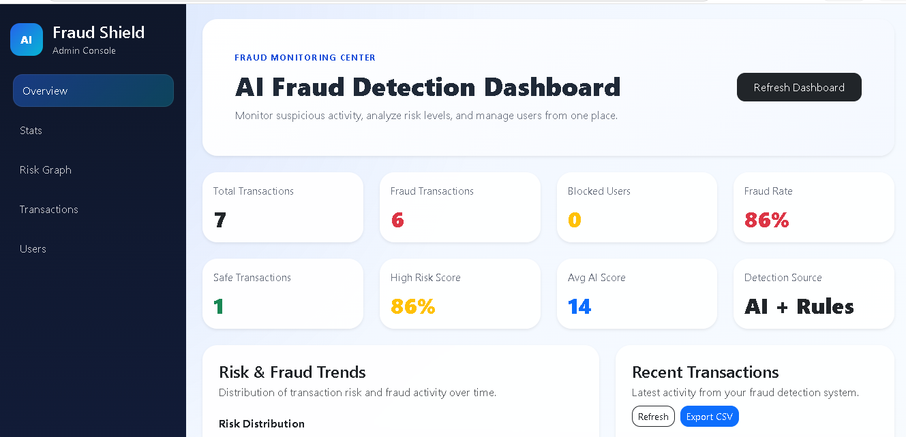
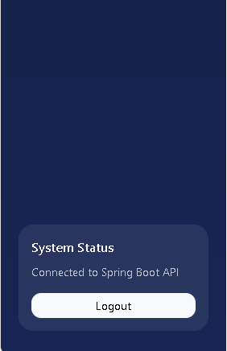
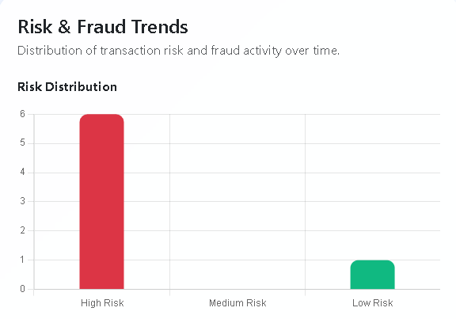
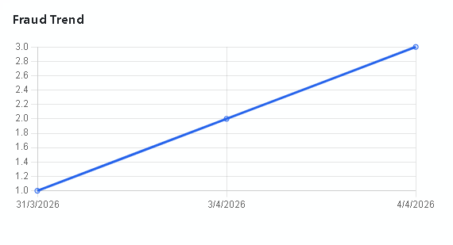
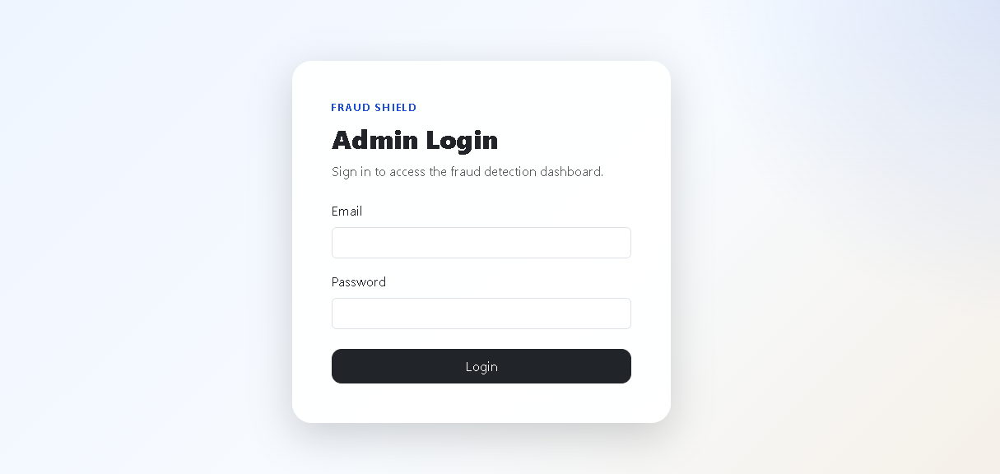
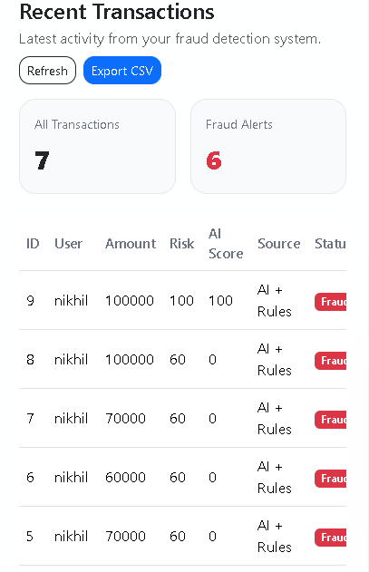
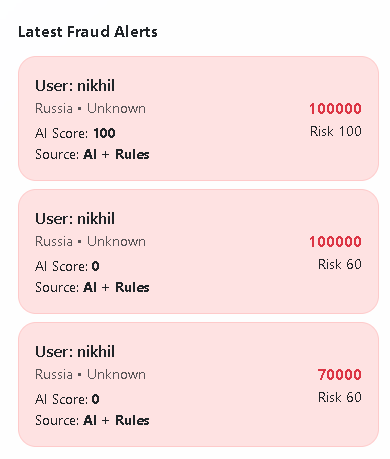
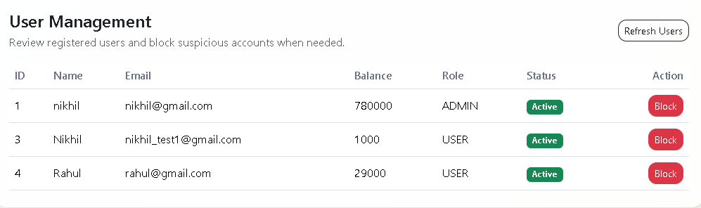

# AI Fraud Detection System

Developed by **Nikhil Lokhande**

A full-stack AI-powered fraud detection system that detects suspicious transactions using both rule-based logic and a machine learning model. The system provides secure authentication, admin-only monitoring, transaction analytics, AI risk scoring, fraud visualization, and user management.

## Overview

This project simulates a real-world fraud detection platform for banking and digital payment systems. It combines a secure backend, a responsive frontend dashboard, and a separate AI service for fraud prediction.

It uses:
- Spring Boot for backend APIs and business logic
- React for the frontend dashboard
- MySQL for persistent data storage
- FastAPI and Scikit-learn for AI-based fraud prediction
- JWT authentication for secure access control

The system analyzes transactions, calculates fraud risk, allows admin control over suspicious users, and displays insights through a professional dashboard.

## Key Features

- Secure user login using JWT authentication
- Role-based access control for admin dashboard
- Fraud detection using rule-based checks
- AI-based fraud prediction using a trained machine learning model
- Combined fraud scoring using AI + Rules
- Admin dashboard with statistics and charts
- Risk distribution graph
- Fraud trend analysis chart
- Recent transactions view
- AI score column in transaction table
- Export transactions to CSV
- Block and unblock suspicious users
- AI risk score stored in the database
- Responsive frontend dashboard

## Tech Stack

### Backend
- Java 17
- Spring Boot
- Spring Security
- Spring Data JPA
- MySQL
- JWT

### Frontend
- React
- Bootstrap
- Axios
- Chart.js

### AI Service
- Python
- FastAPI
- Pandas
- Scikit-learn
- Joblib


## Project Structure

```text
AI-Fraud-Detection-System
│
├── Spring Boot Backend
│   ├── src
│   └── pom.xml
│
├── Frontend
│   ├── src
│   ├── public
│   ├── package.json
│   └── package-lock.json
│
├── Fraud-AI
│   ├── app.py
│   ├── train_model.py
│   ├── transactions.csv
│   └── fraud_model.pkl
│
├── screenshots
├── .gitignore
└── README.md
## Authentication and Authorization

The system uses JWT authentication for protected routes.

### Access Rules
- `/api/auth/login` and `/api/auth/register` are public
- `/api/transactions/**` requires authentication
- `/api/users/**` requires authentication
- `/admin/**` is restricted to users with ADMIN role
## Screenshots

### Dashboard Overview 1


### Dashboard Overview 2


### Fraud Trend Chart 1


### Fraud Trend Chart 2


### Login Page


### Transactions 1


### Transactions 2


### User Management

## Author

**Nikhil Lokhande**

GitHub: [https://github.com/nikhillokhande22](https://github.com/nikhillokhande22)  
LinkedIn: [https://www.linkedin.com/in/nikhil-lokhande-305805216](https://www.linkedin.com/in/nikhil-lokhande-305805216)

## License

This project is created for portfolio and learning purposes.
